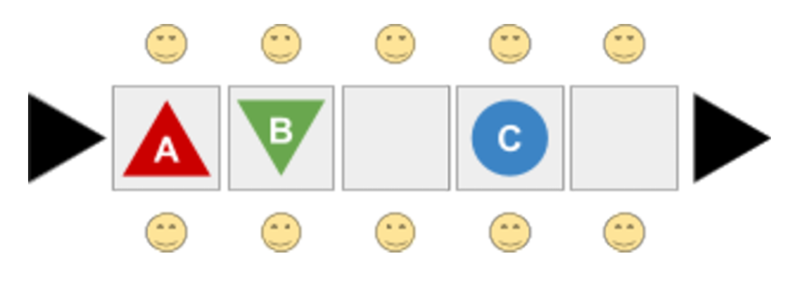

# conveyor-belt-challenge
Challenge for the position of Software Engineering Manager with Raspberry Pi Foundation.

## Problem Statement

### Overview
There is a factory production line around a single conveyor belt.

Components (of type A and B) come onto the start of the belt at random intervals; workers must take one component of each type from the belt as they come past, and combine them to make a finished product C.

The belt is divided into fixed-size slots; each slot can hold only one component or one finished product.  There are a number of worker stations on either side of the belt, spaced to match the size of the slots on the belt, like this:



In each unit of time, the belt moves forwards one position, and there is time for a worker on one side of each slot to either take an item from the slot or replace an item onto the belt. The worker opposite can't touch the same belt slot while they do this. (So you can't have one worker picking something from a slot while their counterpart puts something down in the same place). 

Once a worker has collected one of both types of component, they can begin assembling the finished product. This takes an amount of time, so they will only be ready to place the assembled product back on the belt on the fourth subsequent slot. While they are assembling the product, they can't touch the conveyor belt. Workers can only hold two items (component or product) at a time; one in each hand.

### Task
Create a simulation of this, with three pairs of workers. At each time interval, the slot at the start of the conveyor belt should have an equal (1/3) chance of containing nothing, a component A or a component B.

Run the simulation for 100 steps, and compute how many finished products come off the production line, and how many components of each type go through the production line without being picked up by any workers.

## Submitting your task 
Once you have completed your simulation, submit your source code, any documentation and sample output by replying to the email sent to you with this document.

Feel free to use Generative AI and other assistive technologies in developing your answer. Please be transparent about the tools you used in your submission by including a clear overview of what tools you used and how. Be ready to explain every aspect of the code you submit.  

Submission deadline is 24 hours before your interview.

### Hints and Tips 
- You should expect to spend no more than two or three hours on this challenge. 
- The code does not have to be 'production quality', but we will be looking for evidence that it's written to be somewhat extensible, and that a third party would be able to read and maintain it. 
- Be sure to state your assumptions. 
- During the interview, we may ask about the effect of changing certain aspects of the simulation. (E.g. the length of the conveyor belt.) 
- Flexibility in the solution is preferred, but we are also looking for a sensible decision on where this adds too much complexity. (Where would it be better to rewrite the code for a different scenario, rather than spending much more than the allotted time creating an overly complicated, but very flexible simulation engine?) 
- Don’t hesitate to ask questions. 
- Be mindful that the evaluators may be on Linux, OSX or Windows. Please avoid using platform-specific APIs and clearly document limitations on how your code can be run.

## Implementation

The solution exists in a dedicated [GitHub repository](https://github.com/mariusfilip/conveyor-belt-challenge). Running it requires Python 3.13.2 or later.

> [!WARNING]
> 
> It is strongly recommended to install `virtualenv` and `pip` to create a virtual environment and install the required dependencies: 
> ```bash
> 
> git clone https://github.com/mariusfilip/conveyor-belt-challenge
> pushd conveyor-belt-challenge
> pip install virtualenv
> virtualenv .venv
> .venv/bin/activate
> pip install -r requirements.txt
> ```

In order to leave the virtual environment, run: `deactivate`.

## 